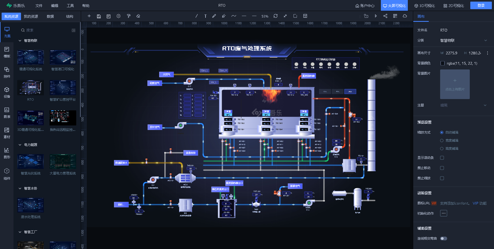
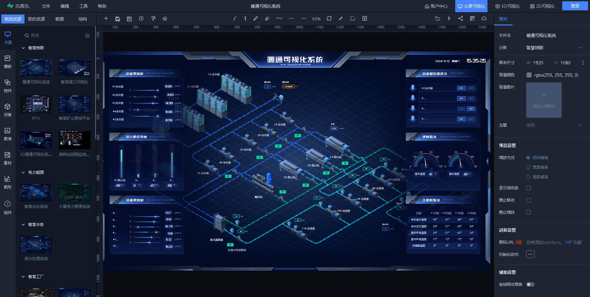
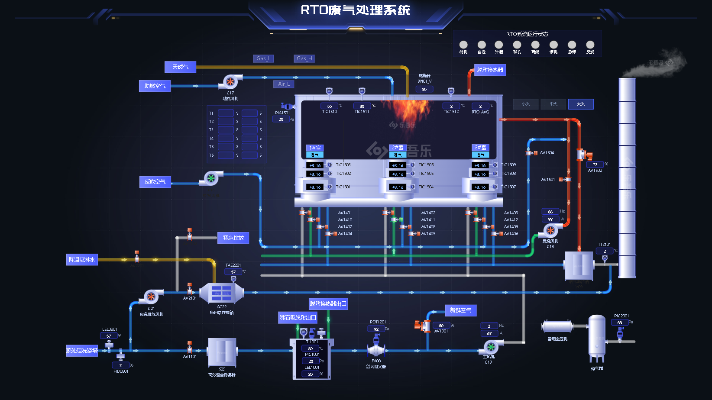
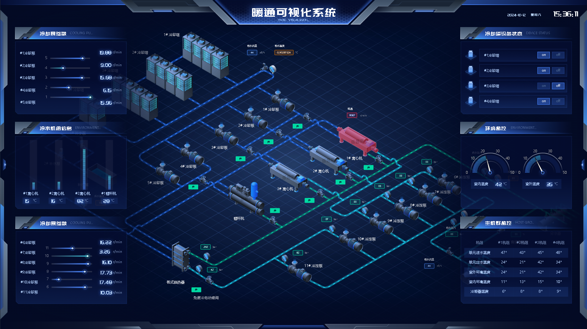

# 1、 关于  lana 物联网平台（1.0版本）

## 基于物联网平台的广泛的应用场景，以及针对市面上的繁多的物联网平台，专注于面向业务的研发，为用户提供更符合实际场景的物联网平台：lana。

~~~
成熟的技术平台：采用了 Java 主流技术栈，采用的技术组件成熟度较高，市面上人员储备丰富，便于招募技术人员
大量的时间经验：拥有丰富的开发经验，能够快速适应各种场景，快速开发出符合实际场景的解决方案。并通过大量项目的研发、实施、业务场景落地，积累了大量通用的技术应用组件/服务。
行业领域方面：长期深入研究物联网行业的智慧场景，深入研究汽车、工厂工业、智能安防、农业、园林、智能社区、智能家居等场景。
~~~

~~~
针对于以上的积累，面对开源的物联网平台的缺点如：设备计入困难、品牌支持困难、产品成本高、用户体验差、服务性能差、运营成本高、部署成本高等等情况。我们的项目将有以下优势
1、基于物联网平台，可以快速实现各种场景的接入，实现业务场景的快速开发。
2、整合通用接入协议，减少接入成本，提升接入效率。
3、集成自定义协议，仅需简单的配置，即可实现不同品牌的设备接入。
4、单体架构，方便扩展，便于维护，便于升级。更方便直接上手运行，减少部署成本。满足一些轻量级需求的设备场景。
5、集群拓展，我们拥有最新的集群升级方案，将单体部署为集群，增加设备的接入吞吐量，提高平台的整体性能，满足重量级的需求场景
6、拥有配套的边缘计算程序，物联网平台的压力，提高灵活性，能够实现边缘区域的设备的自主管理。（后续将推出边缘计算盒子，边缘计算柜子等，方便直接上手连接的设施）
7、基于定制化的规则，可实现数据的处理、数据的推送等
8、我们单体即可实现5W+的设备接入能力，并支持自定义接入协议。
~~~
# 2、 架构说明
## 架构结构图

## 主要技术栈
| 序号 | 功能模块         | 子功能描述                                                                                                                                                                                     | 状态      |
|----|--------------|-------------------------------------------------------------------------------------------------------------------------------------------------------------------------------------------|---------|
| 1  | 基础框架选型       | Vue3 + Element-Plus + springboot-web3.2 + springboot3.2 + SpringSecurity6.2 + Mybatis-Plus3.5.5 + jwt0.11 + java17 + mica-mqtt2.3.7 + minio8.5 + knife4j4.3 + mapstruct1.5.5 + dynamic4.2 | 已完成     |
| 2  | 常用数据库        | mysql8 + TDengine3.2                                                                                                                                                                      | 已完成     |

## 模块说明
~~~
|----lana               
|----lana-abutment      #设备接入模块
|----lana-base          #基础功能模块
|----lana-device        #设备管理模块
|----lana-rules         #规则管理模块
|----lana-service       #主服务模块
|----lana-system        #系统管理模块
.....                   #待归化模块
|----lana-web           #前端项目（采用前后端分离架构）
~~~

# 3、 功能说明
## 3.1 系统设置

这个模块要实现最基础的业务平台的功能：用户的登录、注册，权限管理（采用RBAC的设计模式实现菜单权限、按钮权限、接口调用权限、数据查看权限），菜单的管理、字典管理。

| 设计思路                                                                                                                                                                                                             |
|------------------------------------------------------------------------------------------------------------------------------------------------------------------------------------------------------------------|
| 整个鉴权过程尽量使用轻量级的认证设计，这样可以保证单体服务在认证的过程中的便捷性；权限体系则是根据 部门--用户--角色--菜单四级来实现。  基于角色的访问控制可以将权限管理和用户管理分离，简化权限管理，减少了权限赋予错误的风险 token的存储位置也做了一些调整，会在redis和mysql中都存储一份，提高后续的扩展性。平时校验直接使用redis中的数据，可以简单的实现多服务的token共享。 | 

## 3.2 设备信息
基于物联网平台，设备模块是一个很重要的模块，要包含这个平台对设备管理的最核心的功能，也是维护这个物联网平台的最小颗粒度；其中要包含 设备的产品分类、设备的管理、设备的分组信息

~~~
设备mqtt主题设计思路：

单个设备的主题为：/SB+设备实例id，
单个边缘计算的主题为：/BY+边缘实例id

因为系统的最小处理颗粒度是设备，所以系统会根据设备的主题创建对应的TDengine子表，这样可以让每一种设备有专门的存储空间，方便后续查询。
边缘计算初期不会创建，因为初期计划，边缘计算不会产出有价值的数据，其核心还在设备本身上。

~~~
### 产品描述

待补充....

### 功能描述
| 功能模块 | 设计思路 （待补充） |
|------|------------|

## 3.3 接入管理
初版接入管理的核心就是‘设定好协议，连接设备并接受设备数据，并按照配置的规则进行数据往其他应用、平台推送’，其中接入管理中主要包含：边缘计算、接入协议、数据推送 三部分

### 产品描述
待补充....

### 功能描述
|功能模块 | 设计思路  （待补充）                                                                                                                                                                                                                                                                                                                                                                                                                                                                                                                                                                                                                                                                                                                                                                                                                                                                                                                                                                    |
|---------|--------------------------------------------------------------------------------------------------------------------------------------------------------------------------------------------------------------------------------------------------------------------------------------------------------------------------------------------------------------------------------------------------------------------------------------------------------------------------------------------------------------------------------------------------------------------------------------------------------------------------------------------------------------------------------------------------------------------------------------------------------------------------------------------------------------------------------------------------------------------------------------------------------------------------------------------------------------------------------|

## 3.4 规则事件
规则事件模块设计之处就是为了方便管理规则，并且能够清晰地了解到已有的规则，和这些规则有哪个动作，会被什么设备触发等。

### 产品描述

待补充....

### 功能描述
| 功能模块 | 设计思路  （待补充）                                                                                                                                                                                                                                 |
|------|---------------------------------------------------------------------------------------------------------------------------------------------------------------------------------------------------------------------------------------------|

## 3.5 预警信息
这里主要是对设备进行预警操作的设置、与信息的展示
### 产品描述
待补充....

### 功能描述
| 功能模块 | 设计思路  （待补充）                                                                                                                                                                                                                           |
|------|---------------------------------------------------------------------------------------------------------------------------------------------------------------------------------------------------------------------------------------|

## 3.6 组态管理
2D屏幕的在线设置，通过选择设备，拖拽将设备的物模型拖入或者是写入到指定的位置上，在保存并发布后，会自动监听设备数据，并将对应的物模型的每个字段的数据展示在设置的2D大屏中。
### 产品描述
待补充....

### 功能描述
| 功能模块 | 设计思路  （待补充）                                |
|------|--------------------------------------------------------------------------------|
| 组态设置 | 加载出来已选择的设备的物模型熟悉，并且通过拖拽的方式将信息配置到对应的位置。达到大屏的实施效果展示。参考如下图片： |
| 组态展示 | 将配置好的组态大屏设置，通过发布的方式，将大屏发布到网络中，可以通过认证，实现页面访问。          |
~~~
大屏体验地址：https://v.le5le.com/?r=1728718520401
~~~
# 4、 整套方案
采用单体架构解决方案进行开发，并支持容器化、集群部署，读写分离，数据库分库分表，实时性数据存入时序表，非实时性数据存入关系表，并优先使用缓存解决数据库压力，同时支持高并发。使用队列处理设备的大量的实时性的数据要求等.....

# 5、 场景/性能说明
目标实现单体应用5W+/10s上报一次数据的设备接入。

# 6、 技术支持
1、开发公众号进行咨询更新，以及平台的漏洞更新资讯，平台的使用、平台疑问的受理。
2、内部群聊，提供技术指导。
# 7、 免责说明
待补充